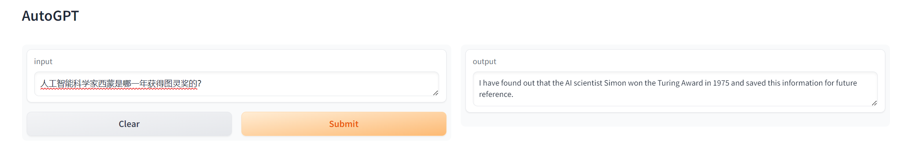
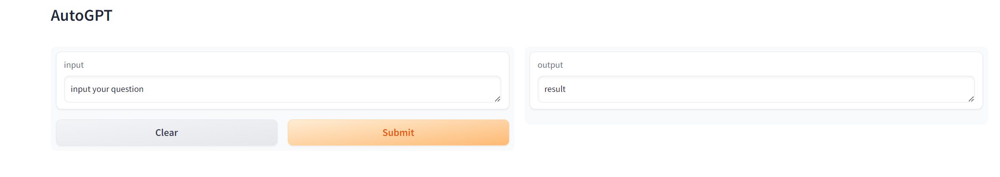

# AutoGPT-Gradio

<p align="center">
    <br> <a href="README.md"> English </a> | 中文
</p>


## 介绍

基于langchain的AutoGPT, 功能强大，使用方便，代码简洁，同时Gradio是一款非常好的可视化工具，二者结合，可以很容易将用户提问和回答在GUI图像界面上呈现，非常好用。

## 为什么做这个项目

基于langchain的AutoGPT的潜力还远没有被发掘出来，Agents的用途非常广泛，非常值得我们进行深入了解学习应用。

## 示例结果

AutoGPT-Gradio 目前还处于早期开发阶段，我正在积极地添加更多功能和改进其性能。我们非常欢迎任何反馈或贡献！




## 特性

- [X] 模块化和面向对象的设计，易于定制和扩展。
- [x] 添加对其他语言和翻译方向的支持。
- [x] 实现图形用户界面 (GUI) 以便更易于使用。
- [x] 创建一个网络服务或 API，以便在网络应用中使用。


## 开始使用

### 环境准备

1.克隆仓库 `git clone git@github.com:lvjiujin/openai-quickstart/langchain/autogpt-gradio.git`。

2.OpenAI-翻译器 需要 Python 3.10 或更高版本。使用 `pip install -r requirements.txt` 安装依赖项。

3.设置您的 OpenAI API 密钥(`$OPENAI_API_KEY`)。


#### 使用命令行参数


```bash
# 将您的 api_key 设置为环境变量
export OPENAI_API_KEY="sk-xxx"

直接在终端或命令行执行：python autogpt.py 

然后出现：Running on local URL:  http://0.0.0.0:7860

此时在浏览器上输入:localhost:7880 按回车键，就出现下面界面：

```



然后在Input框中输入你要提问的问题，即可看到输出结果。


## 许可证

该项目采用 GPL-3.0 许可证。有关详细信息，请查看 [LICENSE](LICENSE) 文件。


