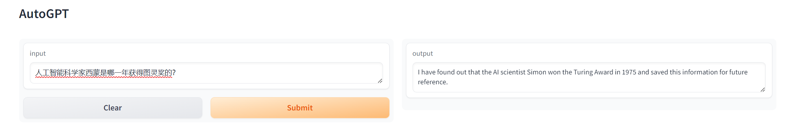

# OpenAI-Translator

<p align="center">
    <br> English | <a href="README-CN.md">中文</a>
</p>


## Introduction

AutoGPT based on langchain is powerful, easy to use, and the code is concise. At the same time, Gradio is a very good visualization tool. The combination of the two can easily present user questions and answers on the GUI image interface, which is very easy to use.

## Why this project

The potential of AutoGPT based on langchain is far from being explored. Agents have a wide range of uses and are worthy of our in-depth understanding and application.

### Sample Results

AutoGPT-Gradio is currently in the early stages of development and I'm actively working on adding more features and improving its performance. Any feedback or contributions are very welcome!



## Features

- [X] Modular and object-oriented design, easy to customize and extend.
- [x] Add support for other languages ​​and translation directions.
- [x] Implement graphical user interface (GUI) for easier use.
- [x] Create a web service or API for use in web applications.


## Getting Started

### Environment Setup

1.Clone the repository `git clone git@github.com:lvjiujin/openai-quickstart/langchain/autogpt-gradio.git`.

2.The `OpenAI-Translator` requires Python 3.10 or later. Install the dependencies with `pip install -r requirements.txt`.

3.Set up your OpenAI API key(`$OPENAI_API_KEY`). 

### Usage


#### Using command-line arguments:

You can also specify the settings directly on the command line. Here's an example of how to use the OpenAI model:

```bash
# Set your api_key as an env variable
export OPENAI_API_KEY="sk-xxx"

Execute directly in the terminal or command line: python autogpt_gradio.py

then appear: Running on local URL:  http://0.0.0.0:7860

At this time, enter: localhost:7880 on the browser and press Enter, the following interface will appear:

```


Then enter the question you want to ask in the Input box and you can see the output results.


## License

This project is licensed under the GPL-3.0 License. See the [LICENSE](LICENSE) file for details.